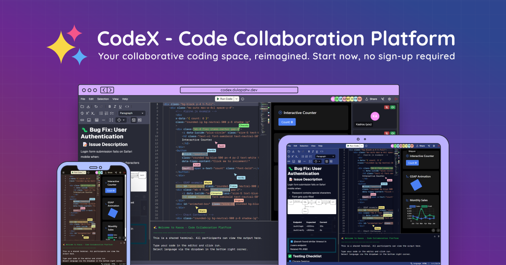

<div align="center">
<h1>CodeX - Code Collaboration Platform</h1>
</div>

<div align="center">
  <h1>💻 CodeX</h1>
  <p>Real-time coding, live preview, and video chat all in your browser,no sign-up required.CodeX is built for speed,simplicity and teamwork.Whether you’re pair programming,conducting remote interviews,hosting coding workshops or just hacking with friends.CodeX eliminates friction and keeps everyone in sync—code,communication and collaboration in one place.</p>
</div>

<div align="center">

[](https://github.com/MeAkash77/CodeX/issues)
[](https://github.com/MeAkash77/CodeX/pulls)
[](https://github.com/MeAkash77/CodeX/commits)
[](https://github.com/MeAkash77/CodeX/graphs/contributors)

[](https://nextjs.org/)
[](https://www.typescriptlang.org/)
[](https://reactjs.org/)
[](https://tailwindcss.com/)
[](https://www.typescriptlang.org/)
[](https://socket.io/)
[](https://nodejs.org/)
[](https://expressjs.com/)
[](https://webrtc.org/)
[](https://prismjs.com/)
[](https://microsoft.github.io/monaco-editor/)
[](https://git-scm.com/)
[](https://vercel.com/)
[](https://render.com/)
[](https://eslint.org/)
[](https://prettier.io/)


</div>

<p align="center">
  <strong>🚀 The all-in-one collaborative coding platform with live code sync, video chat, Git integration, and instant preview.</strong>
</p>

---

## 📖 About CodeX

CodeX is a **real-time online code collaboration platform** designed for developers, educators, and coding enthusiasts.  
It combines **live coding**, **cursor sharing**, **video conferencing**, and **instant UI preview** — all inside your browser, no installation or account required.

---

## ✨ Features

- 📝 **Real-Time Coding** – Instant code sync across all connected users  
- 🖱 **Live Cursor Sharing** – See where your collaborators are typing  
- 🔄 **Instant UI Preview** – Live front-end preview as you type  
- 🎥 **Video & Voice Chat** – WebRTC-powered communication  
- 🔧 **Integrated Git Support** – Pull, push, and manage repos from the browser  
- 🌍 **Multi-Language Support** – Syntax highlighting for multiple languages  
- 💻 **Collaborative Terminal** – Shared command-line access  
- 🚪 **One-Click Rooms** – No sign-up, just share a link  


<div align="center">
  <a href="https://code-x-real-time-code-editor-with-v.vercel.app/">
    
  </a>
</div>

**Frontend Part**


**CodeX is an online code collaboration platform that enables real-time coding, cursor sharing, live UI preview, and video communication with integrated Git support—no sign-up required.**

## Features

- **Real-time Collaboration** - Code together in real-time with cursor sharing, highlighting, and follow mode
- **Shared Terminal** - Execute code and see results together with over 80 supported languages
- **Live Preview** - Preview UI changes instantly with loaded libraries like Tailwind CSS, and more
- **GitHub Integrated** - Save your work and open files from your repositories
- **Shared Notepad** - Take notes together in real-time with rich text and markdown support
- **Video & Voice** - Communicate with your team using video and voice chat

## Table of Contents

- [CodeX - Code Collaboration Platform](#codex---code-collaboration-platform)
  - [Features](#features)
  - [Table of Contents](#table-of-contents)
  - [Project Structure](#project-structure)
  - [Prerequisites](#prerequisites)
  - [Getting Started](#getting-started)
  - [Development](#development)
  - [Test](#test)
    - [Frontend Test](#frontend-test)
    - [Backend Test](#backend-test)
  - [Build](#build)
  - [Deployment](#deployment)
  - [Scripts](#scripts)
  - [Tech Stack](#tech-stack)
  - [Coding Style](#coding-style)
  - [Contributing](#contributing)
  - [User Manual](#user-manual)
  - [License](#license)

## Project Structure

The project is organized as a [monorepo](https://en.wikipedia.org/wiki/Monorepo) using [Turborepo](https://turbo.build/repo/docs):

```txt
CodeX
├── apps/                   # Application packages
│   ├── client/             # Frontend Next.js application
│   │   ├── public/         # Static assets
│   │   ├── src/            # Source code
│   │   │   ├── app/        # Next.js app router pages and API routes
│   │   │   ├── components/ # React components
│   │   │   ├── hooks/      # Custom React hooks
│   │   │   └── lib/        # Utility functions and services
│   │   └── tests/          # Frontend tests (Playwright)
│   └── server/             # Backend Socket.IO server
│       ├── src/            # Source code
│       │   ├── service/    # Backend services
│       │   └── utils/      # Utility functions
│       └── tests/          # Backend tests (Jest)
├── docs/                   # Documentation assets
├── packages/               # Shared packages
│   └── types/              # Shared TypeScript types and interfaces
├── scripts/                # Build and maintenance scripts
├── package.json            # Root package.json
└── pnpm-workspace.yaml     # PNPM workspace configuration
```

## Prerequisites

Before you begin, ensure you have the following installed:

- [Node.js](https://nodejs.org/en/) (v18 or higher)
- [pnpm](https://pnpm.io) (v6 or higher)

If you don't have `pnpm` installed, you can install it globally:

```bash
npm install -g pnpm
```

## Getting Started

After checking the [prerequisites](#prerequisites) above, follow these steps to set up the project:

1. **Clone the repository**

   ```bash
   git clone https://github.com/MeAkash77/CodeX-Real-Time-Code-Editor-with-Video-Chat.git
   cd CodeX
   ```

2. **Install dependencies**

   This will install all dependencies for the frontend and backend applications:

   ```bash
   pnpm install
   ```

   > Note: Git hooks will be automatically installed via Husky when running `pnpm install`

3. **Environment setup**

    Create `apps/client/.env` using the template from `apps/client/.env.example`:

    ```bash
    BETTERSTACK_API_KEY=
    SENTRY_AUTH_TOKEN=
    GITHUB_CLIENT_SECRET_PROD=
    GITHUB_CLIENT_SECRET_DEV=
    SENTRY_SUPPRESS_TURBOPACK_WARNING="1"
    TURBO_TEAM=
    TURBO_TOKEN=
    ```

    > Note: This is a personal project and the required API keys and secrets are not publicly shared. For local development, you'll need to set up your own credentials for GitHub OAuth, Sentry, etc.

## Development

To start the development server for both the frontend and backend applications:

```bash
pnpm dev
```

You can also start them individually:

```bash
# Start only the client
pnpm --filter client dev

# Start only the server
pnpm --filter server dev
```

The application will be available at:

- Frontend: <http://localhost:3000>
- Backend: <http://localhost:3001>

## Test

All test commands can be run from both the root directory and their respective workspaces.

### Frontend Test

Both the frontend server and the backend server will start automatically. To run the frontend tests:

```bash
# In root directory or client workspace
pnpm test:client         # Run all frontend E2E tests
pnpm test:client:ui      # Run frontend tests with UI mode
pnpm test:client:debug   # Debug frontend tests
pnpm test:client:report  # View frontend test report

# Run in client workspace only
pnpm --filter client test:client
```

### Backend Test

The backend server will start automatically. To run the backend tests:

```bash
# In root directory or server workspace
pnpm test:server           # Run backend tests against local server
pnpm test:server:remote    # Run backend tests against remote server
pnpm test:server:watch     # Run backend tests in watch mode (local server)

# Run in server workspace only
pnpm --filter server test:server
```

## Build

This project is configured to build both the frontend and backend applications together with caching from Turborepo. To build the entire project:

```bash
pnpm build
```

However, you can also build them individually:

```bash
# Build frontend
pnpm build:client

# Build backend
pnpm build:server
```

The build artifacts of the frontend will be available in the `apps/client/.next` directory, and the backend will be available in the `apps/server/dist` directory.

## Deployment

The project is configured for automatic deployment through Deploy Hooks which trigger after the GitHub Actions CI/CD pipeline completes successfully:

- Frontend (client): Automatically deploys to [Vercel](https://vercel.com)
- Backend (server): Automatically deploys to [Render](https://render.com)

## Scripts

These are the available scripts in the project:

```bash
# Development
pnpm dev              # Start all applications in development mode
pnpm build            # Build all packages
pnpm build:client     # Build frontend
pnpm build:server     # Build backend
pnpm clean            # Clean all builds, caches, test results, and node_modules

# Testing
pnpm test:client          # Run frontend E2E tests (Playwright)
pnpm test:client:ui       # Run frontend tests with UI mode
pnpm test:client:debug    # Debug frontend tests
pnpm test:client:report   # View frontend test report
pnpm test:server          # Run backend tests against local server
pnpm test:server:remote   # Run backend tests against remote server
pnpm test:server:watch    # Run backend tests in watch mode (local server)

# Linting and Formatting
pnpm lint:check       # Run ESLint checks (frontend only)
pnpm lint:fix         # Fix ESLint issues (frontend only)
pnpm format:check     # Check formatting
pnpm format:fix       # Fix formatting issues
```

You can also run scripts in the specific workspaces

> Note: This will not use Turborepo caching

```bash
# Frontend specific
pnpm --filter client dev
pnpm --filter client build
pnpm --filter client test:e2e

# Backend specific
pnpm --filter server dev
pnpm --filter server build
pnpm --filter server test:socket
```

## Tech Stack

- **Frontend:**
  - [Next.js](https://nextjs.org)
  - [TypeScript](https://www.typescriptlang.org)
  - [Tailwind CSS](https://tailwindcss.com)
  - [shadcn/ui](https://ui.shadcn.com/)
  - [Monaco Editor](https://microsoft.github.io/monaco-editor/) (code editor)
  - [Socket.IO Client](https://socket.io)
  - [Sandpack](https://sandpack.codesandbox.io/) (live preview)
  - [MDXEditor](https://mdxeditor.dev/) (notepad)
  - [simple-peer](https://github.com/feross/simple-peer) (WebRTC)
  - [React Hook Form](https://react-hook-form.com) + [Zod](https://zod.dev/)
- **Backend:**
  - [Node.js](https://nodejs.org)
  - [TypeScript](https://www.typescriptlang.org)
  - [Socket.IO](https://socket.io) (binded to [µWebSockets.js](https://github.com/uNetworking/uWebSockets.js) server)
- **Testing:**
  - [Playwright](https://playwright.dev) (end-to-end testing for frontend)
  - [Jest](https://jestjs.io) (unit testing for backend)
  - [CodeQL](https://codeql.github.com/) (security analysis)
- **Code Quality:**
  - [ESLint](https://eslint.org) (static code analysis)
  - [Prettier](https://prettier.io) (code formatting)
  - [Husky](https://typicode.github.io/husky/) (git hooks)
  - [commitlint](https://commitlint.js.org/) (commit message linting)
- **Build & DevOps:**
  - [Turborepo](https://turbo.build/repo/docs) (monorepo build system)
  - [GitHub Actions](https://github.com/features/actions) (CI/CD)
  - [Vercel](https://vercel.com) (frontend deployment)
  - [Render](https://render.com) (backend deployment)
- **Monitoring & Analytics:**
  - [Sentry](https://sentry.io) (error tracking)
  - [Vercel Analytics](https://vercel.com/docs/analytics) (web analytics)
  - [Cloudflare Web Analytics](https://developers.cloudflare.com/web-analytics/) (web analytics)
  - [Better Stack](https://betterstack.com/) (uptime monitoring and status page)
- **External Services:**
  - [Piston](https://github.com/engineer-man/piston) (code execution)
  - [GitHub REST API](https://docs.github.com/en/rest) (repository management)

## Coding Style

We use several tools to maintain code quality:

- [ESLint](https://eslint.org/) for static code analysis (frontend only)
- [Prettier](https://prettier.io/) for code formatting
- [prettier-plugin-sort-imports](https://github.com/trivago/prettier-plugin-sort-imports) for import statement organization
- [prettier-plugin-tailwindcss](https://github.com/tailwindlabs/prettier-plugin-tailwindcss) for Tailwind CSS class sorting (frontend only)
- [prettier-plugin-classnames](https://github.com/ony3000/prettier-plugin-classnames) for wrapping long Tailwind CSS class names (frontend only)
- [Husky](https://typicode.github.io/husky/) for Git hooks
- [lint-staged](https://github.com/okonet/lint-staged) for running checks on staged files
- [commitlint](https://commitlint.js.org/) for commit message linting

Check and fix code style:

```bash
pnpm lint:check    # Check ESLint issues
pnpm lint:fix      # Fix ESLint issues
pnpm format:check  # Check formatting issues
pnpm format:fix    # Fix formatting issues
```

## Contributing

Contributions are welcome! To contribute to this project, follow these steps:

1. Create a new branch for your feature:

   ```bash
   git checkout -b feat/your-feature-name
    ```

2. Commit your changes following **[Conventional Commits](https://conventionalcommits.org/)**:

    ```bash
    git commit -m "<type>(<optional-scope>): <description>"
    ```

    - `<type>`: Must be one of:

      - `feat`: New features (e.g., "feat: add user authentication")
      - `fix`: Bug fixes (e.g., "fix: resolve memory leak")
      - `docs`: Documentation changes (e.g., "docs: update API guide")
      - `style`: Code style changes (e.g., "style: fix indentation")
      - `refactor`: Code refactoring (e.g., "refactor: simplify auth logic")
      - `perf`: Performance improvements (e.g., "perf: optimize database queries")
      - `test`: Adding/updating tests (e.g., "test: add unit tests for auth")
      - `chore`: Routine tasks/maintenance (e.g., "chore: update dependencies")
      - `ci`: CI/CD changes (e.g., "ci: add GitHub Actions workflow")
      - `revert`: Revert previous changes (e.g., "revert: remove broken feature")

    <br />

    > For a complete commit message guidelines, see **[Conventional Commits](https://conventionalcommits.org/)**.

3. Push your changes and submit a Pull Request with a description of your changes:

    ```bash
    git push origin feat/your-feature-name
    ```

## User Manual

For detailed usage instructions and feature documentation, please refer to the **[User Manual](manual.md)**.

## License

MIT License - see the [LICENSE](LICENSE) file for details.
